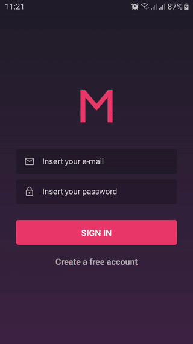

# Meetapp - Mobile

Mobile APP made for the MeetApp project using React Native.

## What is Meetapp?

- It's an app where the users can sign up for free and create Meetups for other users to join and meet.
- Users can use this app only to subscribe to other users meetups and unsubscribe from them.
- The creation of meetups is made on the MeetApp Web version of the app. You can find it [here](https://github.com/igorsouza-dev/meetapp-frontend).

<div align="center">

</div>

## Where is the backend?

- You can find the backend [here](https://github.com/igorsouza-dev/meetapp-backend).

## Before starting

Create a `config.js` file at the root of the project. This file should export the base URL of your backend and the [OneSignal](https://onesignal.com/) ID. I'm using OneSignal for the push notifications.
The file should look like:

```
module.exports = {
  baseURL: 'http://some-ip-or-url.com',
  oneSignalId: '1234567890-123456789',
};

```

#### Disclaimer

This project was tested **only** on Android.

---

<div align="center">
This project was made during the Rockeseat's Gostack Bootcamp 8.0 as a challenge in order to get the certification.
</div>
